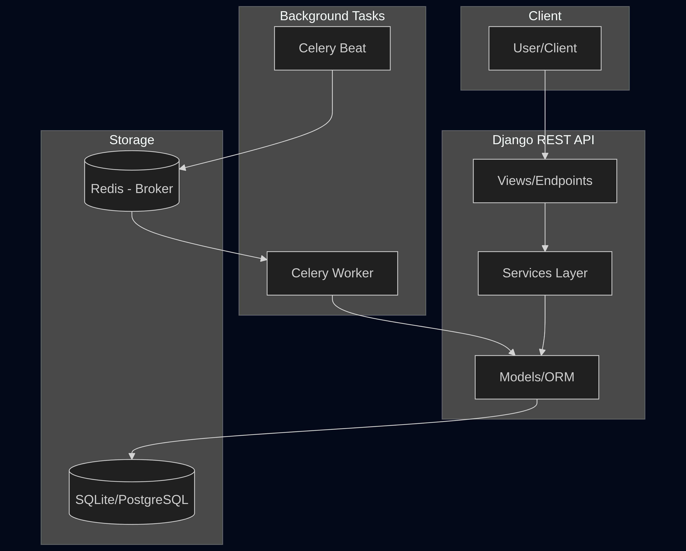
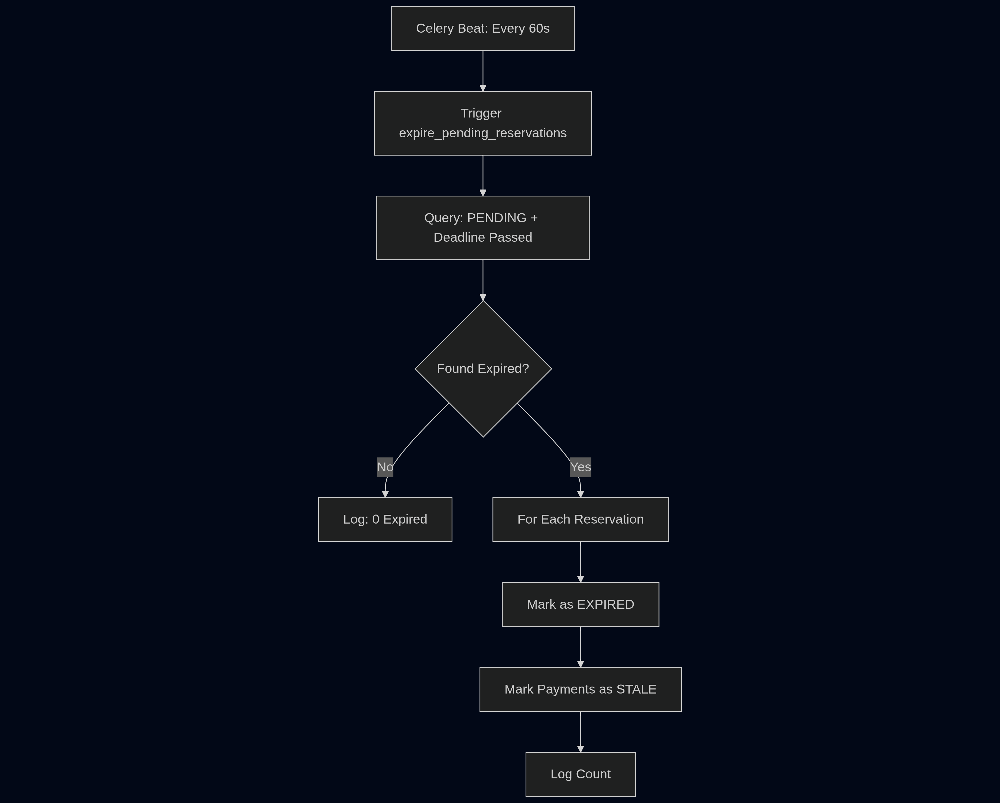
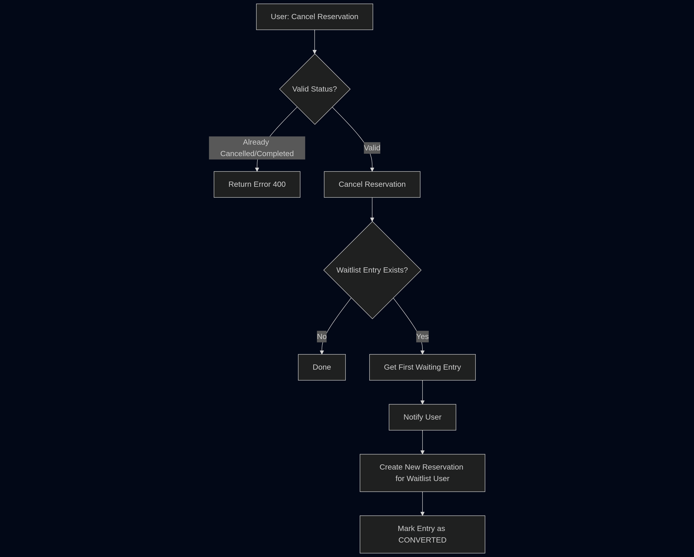
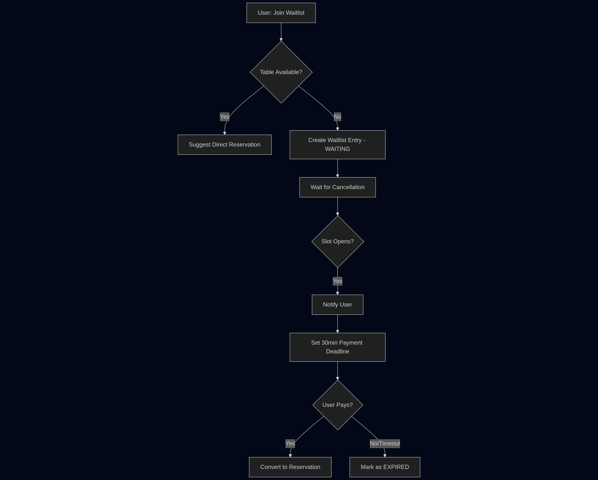

برای نمایش صحیح ساختار درختی پروژه (Project Structure) در گیتهاب، بهترین روش استفاده از **Code Block** (سه علامت بک‌تیک) است. بدون این علامت‌ها، گیتهاب فاصله‌ها و ایندنت‌ها را نادیده می‌گیرد و ساختار بهم می‌ریزد.

در اینجا فایل اصلاح شده را مشاهده می‌کنید (تنها بخش Project Structure تغییر کرده است):

# Restaurant Reservation App

A Django REST API for managing restaurant table reservations with automated payment expiration handling.

## Tech Stack

| Category                    | Technology                  |
| --------------------------- | --------------------------- |
| **Backend Framework** | Django 5.2                  |
| **API**               | Django REST Framework 3.16  |
| **Authentication**    | JWT                         |
| **Task Queue**        | Celery 5.6                  |
| **Task Scheduler**    | django-celery-beat          |
| **Message Broker**    | Redis                       |
| **Database**          | MSSQL                       |
| **API Documentation** | drf-spectacular (OpenAPI 3) |
| **Package Manager**   | uv                          |
| **Python Version**    | 3.12+                       |

---

## Project Setup

### Prerequisites

- Python 3.12+
- Redis server
- uv package manager

### Installation

```bash
# Clone the repository
git clone <repository-url>
cd restaurant-reservation-app

# Install dependencies using uv
uv sync

# Copy environment variables
cp .env.example .env
# Edit .env with your configuration

# Run migrations
uv run python manage.py migrate

# Load fixtures (optional)
uv run python manage.py loaddata users/fixtures/users.json
uv run python manage.py loaddata restaurant/fixtures/restaurant.json
uv run python manage.py loaddata restaurant/fixtures/tables.json
uv run python manage.py loaddata reservation/fixtures/reservations.json

# Start the development server
uv run python manage.py runserver
```

### Docker Setup (Development)

```bash
docker compose -f docker-compose.dev.yml up --build
```

### Running Celery

```bash
# Start Celery worker
uv run celery -A config worker -l info

# Start Celery beat scheduler (for periodic tasks)
uv run celery -A config beat -l info
```

---

## Running Tests

```bash
# Run all tests
uv run python manage.py test

# Run tests for specific app
uv run python manage.py test reservation
uv run python manage.py test restaurant
uv run python manage.py test users

# Run with verbosity
uv run python manage.py test -v 2
```

---

## API Documentation

Once the server is running, access the API documentation at:

- **Swagger UI**: `http://localhost:8001/api/schema/swagger-ui/`
- **ReDoc**: `http://localhost:8001/api/schema/redoc/`

---

## Architecture

### System Architecture Overview



### Automatic Expiration Flow (Celery Task)




### Reservation Cancellation & Waitlist Flow




### Waitlist Entry Flow



---

## Project Structure

```text
restaurant-reservation-app/
├── config/              # Django project configuration
├── users/               # User authentication & management
├── restaurant/          # Restaurant & table management
├── reservation/         # Reservation, payment & waitlist logic
│   ├── services/        # Business logic layer
│   └── tasks.py         # Celery tasks (expiration handler)
├── docker-compose.dev.yml
└── Dockerfile.dev
```